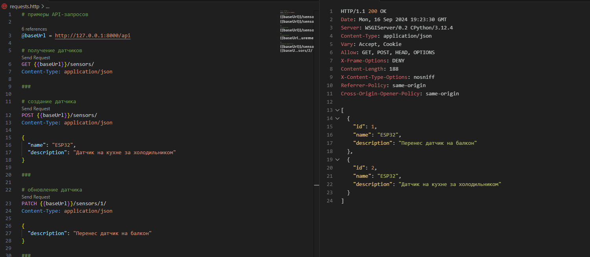
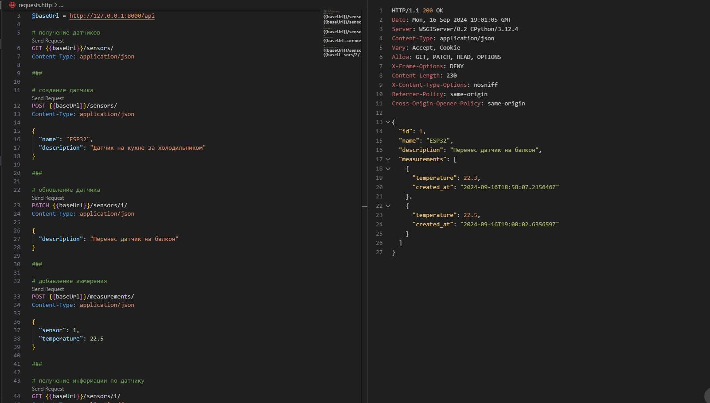

# Знакомство с API на примере Django REST framework
Результат вывода: 
````
GET {{baseUrl}}/sensors/
Content-Type: application/json
````


Результат вывода:
````
GET {{baseUrl}}/sensors/1/
Content-Type: application/json
````

